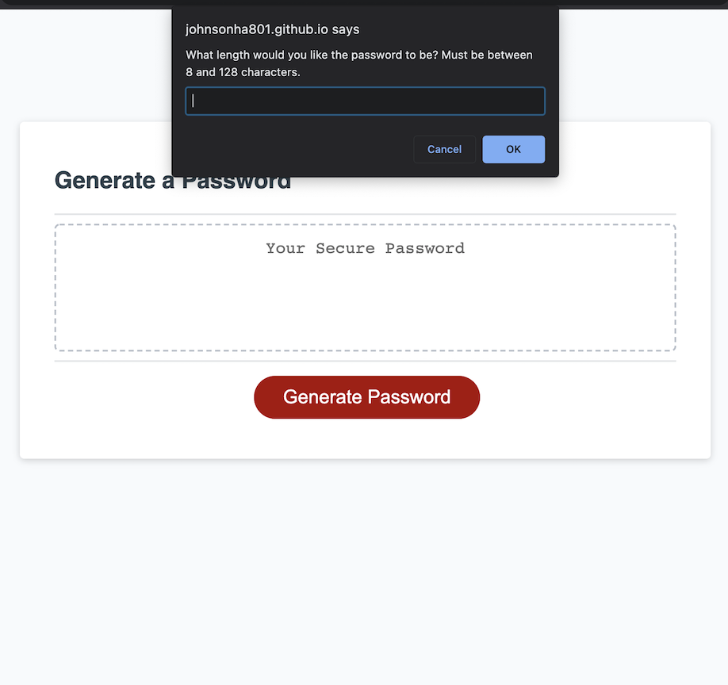

# Password-Generator
#Overview:

This webpage allows a user to automatically generate a secure password compiled of selected criteria on which character sets to include. Using Javascript to ask the user which characters to include and how long the password should be, the function then iterates through a compiled array of approved characters to build a secure password that meets the users specifications.

#Built With:

HTML
CSS
Javascript

#Usage:

Authorized users can click the "Generate Password" button to be guided through a series of prompts that allow the user to determine what character sets and password length they'd like included in the password.

#Links:

GitHub Repository: https://github.com/Johnsonha801/Password-Generator

GitHub Published Site: https://johnsonha801.github.io/Password-Generator/

#Screenshot of page:
